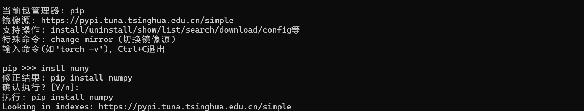
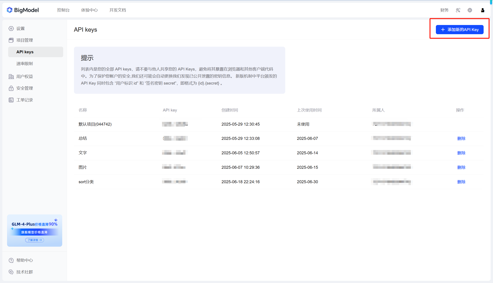

<div align="center">
<h1>PipFixer: AI-Powered Command Correction</h1>

English | [简体中文](README_zh.md)

[](https://github.com/AMTOPA/PipFixer/releases)
[](https://opensource.org/licenses/MIT)
[](https://www.python.org/)
[](https://open.bigmodel.cn/)

</div>

---

## ✨ Features

- 🚀 **AI-powered command correction**  
  Fixes common pip/conda command typos (e.g. "pip istall" → "pip install")
- 📦 **Package name validation**  
  Corrects common package name mistakes (e.g. "pytorch" → "torch")
- 🌐 **Mirror source management**  
  Easy switching between PyPI mirrors (Tsinghua, Aliyun, etc.)
- ✔️ **Smart execution**  
  Recognizes valid commands without unnecessary corrections
- 🔍 **Version checking**  
  Supports various version query formats (e.g. "numpy -v")

---

## 🖥️ Demo

<div align="center">



</div>

---

## 🛠️ Installation

### Prerequisites

- Python 3.7+
- ZhipuAI API key (free model)

### Quick Start

```bash
pip install zhipuai
git clone https://github.com/AMTOPA/PipFixer.git
cd PipFixer
python main.py
```

### 📚 Usage

First run will prompt for:

ZhipuAI API key：Apply for a free API key at [Zhipu AI Platform](https://www.bigmodel.cn/usercenter/proj-mgmt/apikeys):


Preferred package manager (pip/conda)

Mirror source configuration

Enter commands naturally:

```bash
pip >>> instal pytorch
Corrected: pip install torch
Confirm? [Y/n]: y
Special commands:
```

```bash
change mirror  # Switch PyPI mirror source
exit          # Quit the program
```
